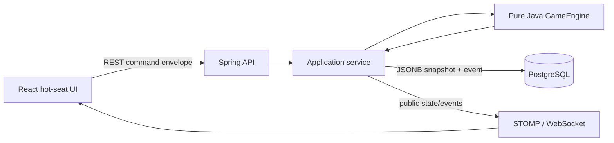
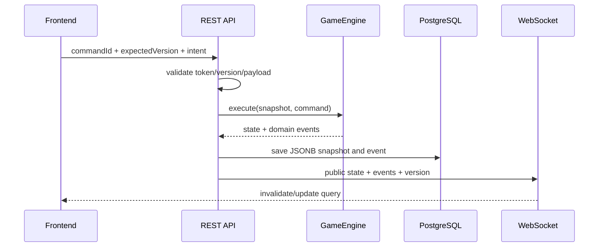

# Hexbound Realms

Hexbound Realms is an original 3–4 player fantasy strategy game prototype. Players lead asymmetric heroes across a deterministic 37-hex valley, build connected holdings, recruit armies, choose actions in secret, and survive escalating monsters. The backend is authoritative; the browser renders server state and submits intent.

## Architecture



The domain packages contain map, production, building, army, combat, monster, and victory rules without Spring or JPA. The application layer loads one aggregate snapshot, verifies the expected version and command ID, executes the engine, saves the new snapshot/event transactionally, and broadcasts a public view. Controllers never access repositories.

The React app uses TanStack Query for snapshots, Zustand only for camera/selection/connection UI state, React Router for setup/game screens, and SVG for the board. Private player state is requested using a temporary seat token only after a handover confirmation. Hidden actions are represented publicly only by `hasSelectedAction`.



## Storage

Flyway creates `games` (UUID, seed, status, phase, round, optimistic version, JSONB state, timestamps) and `game_events` (sequence, command UUID, type, JSONB event batch). `(game_id, command_id)` enforces idempotency and `(game_id, sequence_number)` preserves ordering. Individual hexes and units intentionally remain inside the aggregate snapshot for this prototype.

## REST and live updates

- `POST /api/v1/games`
- `GET /api/v1/games/{gameId}`
- `POST /api/v1/games/{gameId}/players`
- `GET /api/v1/games/{gameId}/players/{playerId}` (private token view)
- `POST /api/v1/games/{gameId}/start`
- `POST /api/v1/games/{gameId}/commands`
- `GET /api/v1/games/{gameId}/events`
- `GET /api/v1/games/{gameId}/legal-actions?playerId=...`
- `GET /api/v1/games/{gameId}/hero-draft`
- `GET /api/v1/reference/heroes`
- `GET /api/v1/reference/cards`
- `GET /api/v1/reference/units`
- `GET /api/v1/reference/monsters`
- OpenAPI UI: `http://localhost:8080/swagger-ui.html`
- WebSocket endpoint: `/ws`; public topic: `/topic/games/{gameId}`

## Implemented vertical slice

- Seeded 37-hex (4/5/6/7/6/5/4) axial map with exact terrain and number-token counts, a central Ancient Capital, separated ruins, distributed villages, inner/middle-ring lair, connected topology, and non-adjacent 6/8 tokens.
- Lobby, 3–4 hero selection, backend-validated manual snake-order Outpost/Road placement, rotating first player, explicit phases, backend 2d6 and d20 RNG, and debug forced rolls.
- Simultaneous production, City output rule, Merchant’s single adjacent-number activation, and monster production blocking.
- Open player-to-player resource/gold proposals with atomic acceptance, 4:1 fallback bank trades, two Basic Action Points, sequential player turns, action cooldown, and stronger Main Action categories.
- Terrain-wide exploration with Ranger range benefits and typed outcomes for wilderness, villages, Trade Lands, Monster Lairs, Ruins, and the Capital.
- Unit power conversion capped at +6, fatigue/exhaustion, garrison-only passive defense, Shield/Counterattack/Evacuation/Ambush reaction math, natural 1/20, monster damage/rewards, and escalating unresolved monsters.
- Glory categories, all five seal evaluators, final-round qualification, event history, typed errors, optimistic locking, idempotency, public/private DTOs, and live state refresh.
- Twenty backend-owned text cards and a five-card market presentation.

### Hero draft and simultaneous attacks

- Players join without Heroes. The seed determines initial order and the Hero draft uses its reverse.
- Hero selection is private until confirmation; confirmed Heroes are unique by default and publicly visible.
- Pre-placement Hero swaps require both players, and starting Outposts/Roads use snake order.
- ATTACK requires a locked private plan containing source, target, units, Hero participation, and an optional tactic.
- All plans are revealed together and calculated from the same pre-combat state before damage and fatigue are applied.
- Conflict detection covers one-way assaults, reciprocal clashes, Hero duels, chain attacks, and multi-attacks.

## Local development

Start PostgreSQL:

```bash
docker compose up -d postgres
```

The project exposes PostgreSQL on host port `5433` by default to avoid conflicts with local
PostgreSQL installations. Override it with `POSTGRES_PORT` if required. Containers communicate
internally on port `5432`.

Backend (Java 21):

```bash
cd backend
./mvnw spring-boot:run
```

Frontend:

```bash
cd frontend
npm install
npm run dev
```

Tests and production build:

```bash
cd backend && ./mvnw test
cd frontend && npm run test
cd frontend && npm run build
```

Full stack:

```bash
docker compose up --build
```

In the Docker stack, edge nginx is exposed on host port `80` by default and proxies the frontend,
`/api`, and `/ws` through one public origin. Override `PUBLIC_PORT` when port `80` is already in
use. The backend is still exposed on host port `8082` by default for direct local debugging; override
that with `BACKEND_PORT` when needed.

Open `http://localhost` or the configured public URL. The setup screen creates a seeded four-player lobby. Players choose unique Heroes during a private reverse-order hot-seat draft before snake placement begins.

## Current limitations

This is a deliberately compact vertical slice rather than the complete long-form board game. Temporary access rights, promises, and assistance agreements are not yet executable trade assets; exploration outcomes are typed prototype rewards rather than full quest/event chains. Village contribution/quest/diplomacy/conquest, card effect execution, formal monster assistance contracts, settlement upgrades, damage allocation, mercenary renewal, and every debug mutation remain incomplete. Combat currently resolves a single adjacent army against a monster; expanded player settlement damage/capture and negotiated defender allocation are the next gameplay increment. There is no authentication, matchmaking, AI, or final artwork.

## Screenshots

Add release screenshots here after running the Docker stack:

- Setup and seed screen
- 37-hex realm during World phase
- Private Planning handover
- Monster attack resolution

## Roadmap

1. Complete village approaches, Loyalty events, promises, and formal assistance reward enforcement.
2. Add market purchase/card timing and private reaction selection endpoints.
3. Expand combat into declaration, defensive response, allocation, retreat, capture, and hero recovery substates.
4. Implement settlement upgrades/buildings, richer negotiated trade assets, quests, artifact inventory, and full seal progression sources.
5. Add PostgreSQL/Testcontainers API tests and Playwright multi-seat plus forced-7 flows in CI.
6. Improve accessibility, responsive board controls, reconnection backoff, and original iconography.
